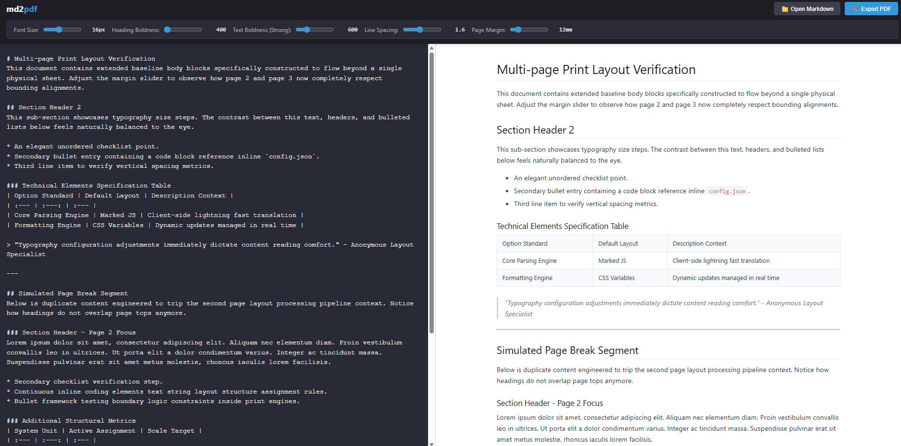

# md2pdf

A minimalist, privacy-first Markdown editor and live preview tool designed specifically to generate beautiful, perfectly formatted PDFs using your browser's native print engine. 

## ✨ Features

* **Real-time Live Preview:** Instantly translates Markdown to styled HTML using `marked.js`.
* **Dynamic Typography Controls:** Fine-tune font size, heading weight, text boldness, line spacing, and print margins in real time using interactive UI sliders.
* **Optimized Print Specs:** Uses modern CSS `@page` media rules to prevent awkward layout fragmentations (e.g., table rows or blockquotes splitting awkwardly across page breaks).
* **Local & Secure:** Completely client-side. Your files never touch a server. Open existing `.md` files directly from your file system.

## 🚀 Quick Start

1. Clone or download this repository.
2. Open `md2pdf.html` directly in any modern web browser (Chrome, Edge, or Safari recommended for best PDF rendering).
3. Write or open your Markdown text, adjust the layout sliders, and click **🎉 Export PDF** (or press `Ctrl+P` / `Cmd+P`).

> **Tip:** In the browser print dialog, make sure to set the layout to **Portrait**, margins to **Default** (as the app handles margins internally), and enable **Background graphics** if needed.

## 🛠️ Built With

* HTML5 & Semantic Layouts
* CSS3 Custom Properties (Variables)
* [Marked.js](https://github.com/markedjs/marked) - Lightning-fast Markdown parsing
